# Spring AI for RAG on Oracle 23ai Vector DB with OpenAI and private LLMs

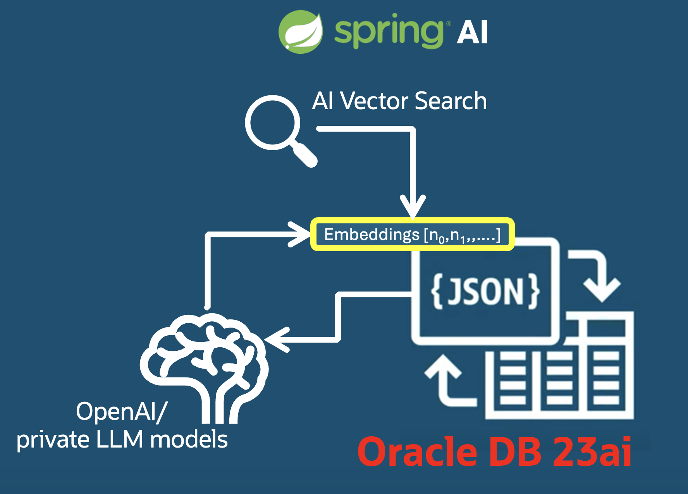

## Introduction

In this demo, we'll guide you through the process of leveraging Java, Spring Boot, Oracle DB23ai and the innovative Spring AI APIs to create next-generation applications.

- Build a Spring Boot Application with RAG (Retrieval Augmented Generation): Discover how to leverage Spring AI to implement a knowledge management system that retrieves relevant information and utilizes large language models to generate insightful responses.
- Integrate Domain Knowledge from Oracle 23ai: Learn how to connect your Spring Boot application with Oracle's 23ai to access and utilize domain-specific knowledge for more accurate and relevant responses.
- Transition to Production with Oracle Backend Platform: We'll address the challenges of moving your knowledge management system from development to production using the Oracle Backend Platform for Spring Boot and Microservices.

Check out [demo here](https://www.youtube.com/watch?v=H2w6oULzFCo&list=PLPIzp-E1msraY9To-BB-vVzPsK08s4tQD&index=26)

The demo shows a Retrieval-Augmented Generation using the following modules:

* Spring AI API
* Oracle DB 23ai
* OpenAI Embeddings
* OpenAI Chat
* OLLAMA local LLM embeddings model
* OLLAMA local LLM LLama2 model for chat

This demo is based on a early draft example of **Spring AI API**'s implementation for the **Oracle 23ai** as vector store, according to the specifications reported here: **[Vector DBs](https://docs.spring.io/spring-ai/reference/api/vectordbs.html)**.

There are two different types of files that contribute to the Retrieval-Augmented Generation (RAG) system in this solution:

- **PDF** file is split in chunks and stored as text with vector embeddings.
- **JSON** docs are created exploiting the **JSON-Duality** capability on existing tables

The interface, that uses Oracle Database 23ai as a Vector Store in a Spring AI pipeline, is the following:

```
public interface VectorStore {

        void add(List<Document> documents);

        Optional<Boolean> delete(List<String> idList);

        List<Document> similaritySearch(SearchRequest request);

        List<Document> similaritySearch(String query);
}
```

These operations allow uploading documents into a vector database, searching for similar documents using the specific vector distance algorithm chosen (you can change this in the `.properties` files). 

```
default List<Document> similaritySearch(String query) {
    return this.similaritySearch(SearchRequest.query(query));
}
```

The file `src/main/java/com/example/demoai/OracleDBVectorStore.java` holds this implementation.

The Vector Store saves the data in this **VECTORTABLE**:

```
CREATE TABLE VECTORTAB (
        id NUMBER GENERATED AS IDENTITY,
        text CLOB,
        embeddings VECTOR,
        metadata JSON,
        PRIMARY KEY (id)
);
```

The **id** will be based on an generated **Identity** Column key, but this can be changed if you prefer.

The metadata content depends on what's coming from Document object, and in this case it will hold the following data:

```
{
    "page_number":"xxx",
    "file_name":"xxx", 
}
```

This table is created at each application startup by default but, by configuring the `config.dropDb` parameter to `false` in  `application-dev.properties`, you can accumulate data every time you start up the application startup, in the same vector tab, and these documents will increase the vector database's knowledge base.

## Docs

With regards to endpoint services, you can find the implementation in [DemoaiController.java](src/main/java/com/example/demoai/controller/DemoaiController.java). The following main REST services have been implemented:

- **/store**

    Accepts a PDF doc to be chunked, vector embeddings are created and stored in the **VECTORTABLE**.

- **/store-json**

    Providing the name of a **relational duality view** created on the DB, this service creates, for each JSON record, a vector embedding, chunks it, and stores it in the **VECTORTABLE**. This service shows that you can put both structured and unstructured text data into the RAG, and you'll be able to query this data in natural language as querying a JSON document.

- **/rag**
    Providing a query in natural language, it manages in a Retrieval-Augmented Generation pipeline that uses the content of **VECTORTABLE**, adding the most similar chunks to the question to the context and sending everything using a template in the file: [prompt-template.txt](src/main/resources/prompt-template.txt)

The following tests have also been implemented, to debug and play with the solution if you're really interested:

- **/search-similar**

    Returns a list of the nearest chunks to the message provided stored in the **VECTORTABLE**. This means, you can check the "closest matches" in your vector database. It's useful to get info about the context used to determine the prompt sent to the LLM for the completion process and use as references to provide a response.

- **/delete**

    Allows you to remove a list of chunks, identified by their IDs, from **VECTORTABLE**.

- **/embedding**

    Provide, given an input string, its corresponding generated vector embedding.

- **/generate**

    Chat client that doesn't use the RAG pipeline. It could be used as a baseline to show the differences between a response provided by the LLM service as-is (OpenAI, OLLAMA) and an augmented request. It's useful to check if any public content has been used for LLM training, whether the response is near to what you expect, without providing your documents.

## 0. Prerequisites

### JDBC driver for Oracle DB 23ai


This demo works with the latest `ojdbc11.jar` driver related to the Oracle DBMS (23.4). To run this project, download this driver from Oracle site or directly from your DB server, looking in the directory: `$ORACLE_HOME/jdbc/lib/ojdbc11.jar`. After downloading in your local home dir, import it as a local Maven artifact with this command:

```
mvn install:install-file -Dfile=<HOME_DIR>/ojdbc11.jar -DgroupId=com.oracle.database.jdbc -DartifactId=ojdbc11 -Dversion=23.4.0.0 -Dpackaging=jar -DgeneratePom=true
```
or including in the `pom.xml` the following dependency:

```xml
<dependency>
	<groupId>com.oracle.database.jdbc</groupId>
	<artifactId>ojdbc11</artifactId>
	<version>23.4.0.24.05</version>
</dependency>
```

### Environment variables

Set the correct environment variables in a `env.sh` (or put these directly into `/home/$USER/.bashrc`) file with this content, according your server IPs (if you're planning on deploying with oLLaMA):

```
export OPENAI_URL=https://api.openai.com
export OPENAI_MODEL=gpt-3.5-turbo
export OPENAI_EMBEDDING_MODEL=text-embedding-ada-002
export VECTORDB=[VECTORDB_IP]
export DB_USER=vector
export DB_PASSWORD=vector
export OLLAMA_URL=http://[GPU_SERVER_IP]:11434
export OLLAMA_EMBEDDINGS=NousResearch--llama-2-7b-chat-hf
export OLLAMA_MODEL=llama2:7b-chat-fp16
export OPENAI_API_KEY=[YOUR_OPENAI_KEY]
#export OPENAI_URL=http://[GPU_SERVER_IP]:3000
#export OPENAI_MODEL=NousResearch--llama-2-7b-chat-hf
```

To invoke both OpenAI `gpt-3.5-turbo` and `text-embedding-ada-002`, you'll also need your `YOUR_OPENAI_KEY`, which must be obtained directly from the [Open AI developer platform](https://platform.openai.com/).

About the OLLAMA_EMBEDDINGS/MODEL used, you are free for your experiment to go on the [OLLAMA Library](https://ollama.com/library) and choose other models.

As you can see, you can configure also the `OPENAI_URL`, which helps to invoke OpenAI LLMs providers compatible with the OpenAI APIs. This way, you can switch easly to other providers, even private ones.

Set env with command in a shell:

```
source ./env.sh
```

## 1. Setup

### Oracle Database 23ai setup

1. Download and install from [Oracle Database Free Get Started](https://www.oracle.com/database/free/get-started/) site an **Oracle Database 23ai Free**, for example, as a docker container in this way:

```
docker run -d -p 1521:1521 --name db23ai container-registry.oracle.com/database/free:latest
docker exec db23ai ./setPassword.sh manager
```

2. After startup, download and install an Oracle Instant Client from the same [site](https://www.oracle.com/database/free/get-started/), and connect to the instance as shown here:

```
sqlplus sys/manager@"${VECTORDB}:1521/FREEPDB1" as sysdba
```

3. If running locally:

```
sqlplus sys/manager@"localhost:1521/FREEPDB1" as sysdba
```

to create a **vector** user to run the example:

```
create user vector identified by "vector";
grant connect to vector;
grant resource to vector;
alter user vector default role connect, resource;
alter user vector quota unlimited on users;
```

Once we've created the user, we'll be able to use it in our Spring AI application by modifying `application-dev.properties`.

If running locally:

```
sqlplus vector/vector@"localhost:1521/FREEPDB1" as sysdba
```

We can check the content by connecting to the Oracle DB:

```
sqlplus vector/vector@"${VECTORDB}:1521/FREEPDB1"
```

### Application

In the `application-dev.properties` files will be used the environment variables set at the step before:

```
spring.ai.openai.api-key=${OPENAI_API_KEY}
spring.ai.openai.base-url=${OPENAI_URL}
spring.ai.openai.chat.options.model=${OPENAI_MODEL}
spring.ai.openai.embedding.options.model=${OPENAI_EMBEDDING_MODEL}
spring.ai.openai.chat.options.temperature=0.3
spring.datasource.url=jdbc:oracle:thin:@${VECTORDB}:1521/ORCLPDB1
spring.datasource.username=${DB_USER}
spring.datasource.password=${DB_PASSWORD}
spring.datasource.driver-class-name=oracle.jdbc.OracleDriver
config.tempDir=tempDir
config.dropDb=true
config.vectorDB=vectortable
config.distance=EUCLIDEAN
spring.servlet.multipart.max-file-size=10MB
spring.servlet.multipart.max-request-size=20MB
spring.ai.ollama.base-url=${OLLAMA_URL}
spring.ai.ollama.embedding.options.model=${OLLAMA_EMBEDDINGS}
spring.ai.ollama.chat.options.model=${OLLAMA_MODEL}
```

In `application.properties`, check if the default env is set as `dev`:

```
spring.profiles.active=dev
```

Then build and run the application:

- Set env: `source ./env.sh`
- Build: `mvn clean package -Dmaven.test.skip=true`
- Run: `mvn spring-boot:run`

For each source update, repeat these two steps.

## 1. Test OpenAI version

Check code:

pom.xml:

```
<!--//CHANGE-->
<!-- Ollama for embeddings/chat
    <dependency>
        <groupId>org.springframework.ai</groupId>
        <artifactId>spring-ai-ollama-spring-boot-starter</artifactId>
    </dependency>
-->
```

DemoaiController.java:

```
    //CHANGE
    //import org.springframework.ai.ollama.OllamaEmbeddingClient;
    //import org.springframework.ai.ollama.OllamaChatClient;
    ...

    //CHANGE
    private final EmbeddingClient embeddingClient;
    //private final OllamaEmbeddingClient embeddingClient;

    //CHANGE
        private final ChatClient chatClient;
        //private final OllamaChatClient chatClient;

    ...

    //CHANGE
        @Autowired
        public DemoaiController(EmbeddingClient embeddingClient, @Qualifier("openAiChatClient") ChatClient chatClient, VectorService vectorService) {  // OpenAI full
        //public DemoaiController(OllamaEmbeddingClient embeddingClient, @Qualifier("openAiChatClient") ChatClient chatClient, VectorService vectorService) {  // Ollama Embeddings - OpenAI Completion 
        //public DemoaiController(OllamaEmbeddingClient embeddingClient, OllamaChatClient chatClient, VectorService vectorService) { // Ollama full 

```

VectorService.java:

```
    //CHANGE
    //import org.springframework.ai.ollama.OllamaChatClient;
    ...
    //CHANGE
        private final ChatClient aiClient;
        //private final OllamaChatClient aiClient;

        //CHANGE
        VectorService(@Qualifier("openAiChatClient") ChatClient aiClient) {
        //VectorService(OllamaChatClient aiClient) {
```

DemoaiApplication.java:

```
    //CHANGE
    //import org.springframework.ai.ollama.OllamaEmbeddingClient;

    ...
    //CHANGE
        @Bean
        VectorStore vectorStore(EmbeddingClient ec, JdbcTemplate t) {
        //VectorStore vectorStore(OllamaEmbeddingClient ec, JdbcTemplate t) {
            return new OracleDBVectorStore(t, ec); 
        }

```

### Pre document store

#### Generic chat

```bash
curl -X POST http://localhost:8080/ai/generate \
    -H "Content-Type: application/json" \
    -d '{"message":"What is a Generative AI?"}' | jq -r .generation
```

Here's a sample output from the command:

```
    Generative AI refers to artificial intelligence systems that are capable of creating new content, such as images, text, or music, based on patterns and examples provided to them. These systems use algorithms and machine learning techniques to generate realistic and original content that mimics human creativity. Generative AI can be used in a variety of applications, such as creating art, writing stories, or designing products.
```

#### RAG request without any data stored in the DB

```
curl -X POST http://localhost:8080/ai/rag \
        -H "Content-Type: application/json" \
        -d '{"message":"Can I use any kind of development environment to run the example?"}'
```

Output from the command:

```
    {
        "generation" : "Based on the provided documents, it is not specified whether any kind of development environment can be used to run the example. Therefore, I'm sorry but I haven't enough information to answer."
    }
```

### Search on data coming from a PDF stored

Store a PDF document in the DBMC 23c library: [**Oracle® Database: Get Started with Java Development**](https://docs.oracle.com/en/database/oracle/oracle-database/23/tdpjd/get-started-java-development.pdf) in the Oracle DB 23ai with embeddings coming from the OpenAI Embedding service. Dowload locally, and run in a shell:

```
curl -X POST -F "file=@./docs/get-started-java-development.pdf" http://localhost:8080/ai/store
```

**Note**: this process usually takes time because document will be splitted in hundreds or thousands of chunks, and for each one it will asked for an embeddings vector to OpenAI API service. In this case has been choosen a small document to wait a few seconds.

#### Q&A Sample

Let's look at some info in this document and try to query comparing the results with the actual content:

- **4.1.1 Oracle Database**

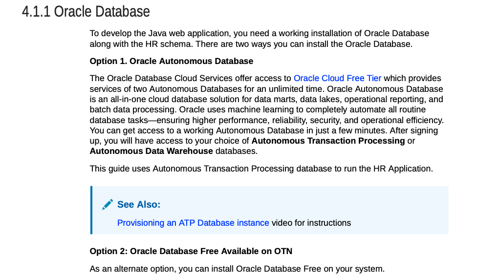

```
curl -X POST http://localhost:8080/ai/rag \
    -H "Content-Type: application/json" \
    -d '{"message":"Which kind of database you can use to run the Java Web example application) "}' | jq -r .generation
```

Response:

```
    You can use either Oracle Autonomous Database or Oracle Database Free available on OTN to run the Java Web example application.
```

- **4.1.5 Integrated Development Environment**

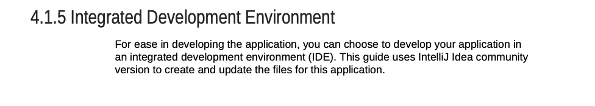

```
curl -X POST http://localhost:8080/ai/rag \
    -H "Content-Type: application/json" \
    -d '{"message":"Can I use any kind of development environment to run the example?"}' | jq -r .generation
```

Response:

```
    Based on the information provided in the documents, you can use an Integrated Development Environment (IDE) like IntelliJ Idea community version to develop the Java application that connects to the Oracle Database. The guide specifically mentions using IntelliJ Idea for creating and updating the files for the application. Therefore, it is recommended to use IntelliJ Idea as the development environment for running the example.
```

- **4.2 Verifying the Oracle Database Installation**

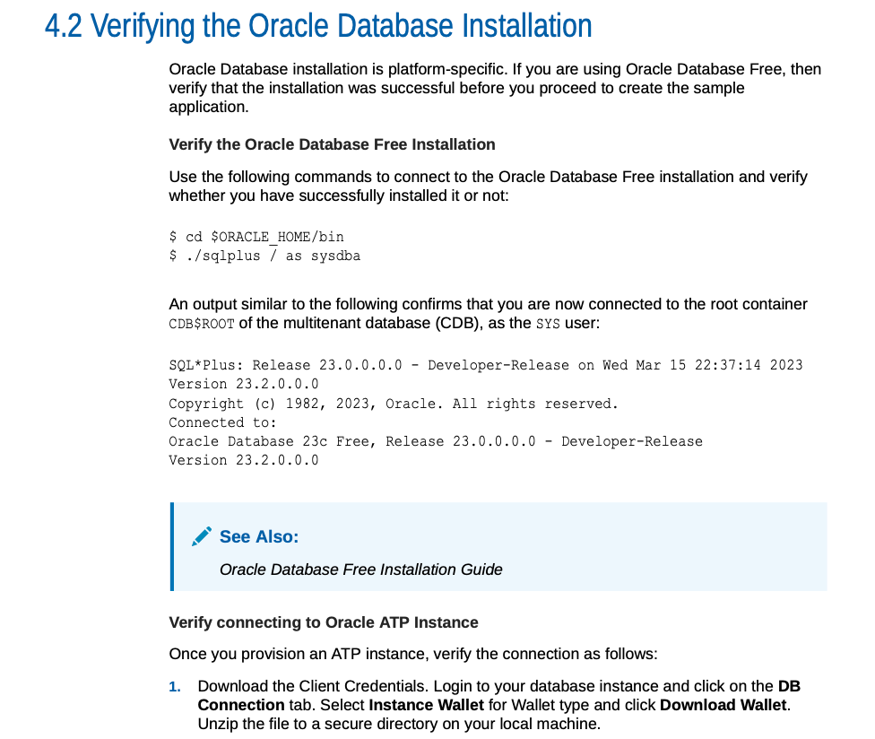

```
curl -X POST http://localhost:8080/ai/rag \
    -H "Content-Type: application/json" \
    -d '{"message":"To run the example, how can I check if the dbms it is working correctly?"}' | jq -r .generation
```

Response:

```
    To check if the Oracle Database is working correctly, you can verify the installation by connecting to the database using the following commands:
    1. Navigate to the Oracle Database bin directory: $ cd $ORACLE_HOME/bin
    2. Connect to the database as sysdba: $ ./sqlplus / as sysdba

    If the connection is successful, you will see an output confirming that you are connected to the root container of the database. This indicates that the Oracle Database installation is working correctly. Additionally, you can download the Client Credentials for an ATP instance and verify the connection by following the steps provided in the documentation.
```

First, let's ask for a question not related to the document stored:

```
curl -X POST http://localhost:8080/ai/rag \
        -H "Content-Type: application/json" \
        -d '{"message":"How is the weather tomorrow?"}' | jq -r .generation
```

Response:

```
{
    "generation" : "I'm sorry but I haven't enough info to answer."
}
```

Then, let's test similarity search for message **"To run the example, how can I check if the dbms it is working correctly?"** example. The `top_k` parameter determines how many nearest chunks to retrieve is set to **4** by default, and the result set is by default in reverse order. So, we need to execute the fololwing command:

```
curl -X POST http://localhost:8080/ai/search-similar \
        -H "Content-Type: application/json" \
        -d '{"message":"To run the example, how can I check if the dbms it is working correctly?"}' | jq '.[3]'
```

Then, we test the deletion. Indexes begin counting at `1`, so let's execute the following command to delete occurrences 1, 4 and 5:

```
curl "http://localhost:8080/ai/delete?id=1&id=5&id=4"
```

## 2. Running generations and chat with private LLMs through OLLAMA

We'll need to create an OCI Compute instance and install OLLAMA inside. Then, we will expose the server through an Internet Gateway and allow our Spring AI application connect to the OLLAMA server and make the equivalent requests as with OpenAI generations.

The following shape and images are recommended for the server: (it will require a GPU, as we'll be running an HPC load that will require lots of computing! More than the CPU can handle at this moment without quantization enabled.)

- Shape: `VM.GPU.A10.2` (2x NVIDIA A10 Tensor Cores)
- OCPU: 30
- GPU Memory: 48GB
- CPU Memory: 480GB
- Storage: >250GB
- Max Network Bandwidth: 48Gbps (6GBps)
- Image: Oracle Linux 8.9

1. From OCI console, choose Compute/Instances menu:

    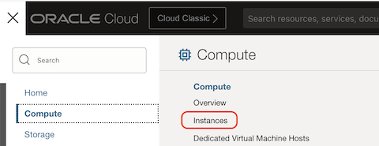

2. Press **Create instance** button:

    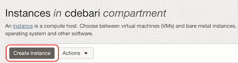

3. Choose `VM.GPU.A10.2` shape, selecting **Virtual machine**/**Specialty and previous generation**:

    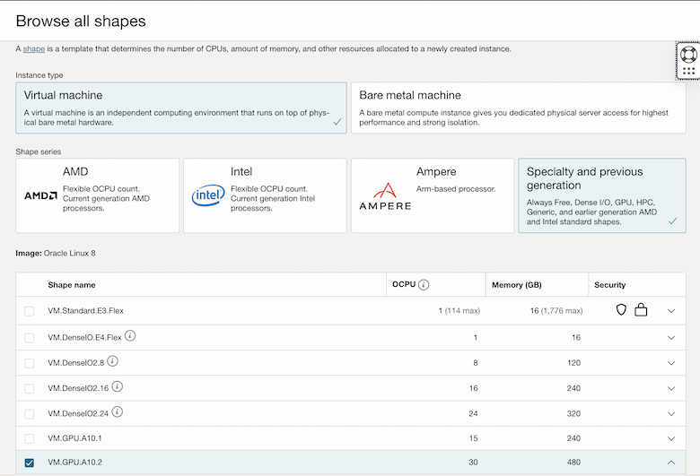

4. Choose the Image `Oracle-Linux-8.9-Gen2-GPU-2024.02.26-0` from Oracle Linux 8 list of images:

    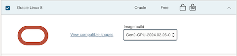

5. Specify a custom boot volume size and set 100 GB:

    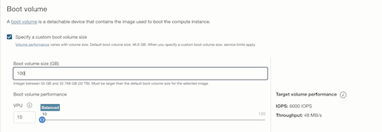

6. Create the image.

7. At the end of creation process, obtain the **Public IPv4 address**, and with your private key (the one you generated or uploaded during creation), connect to:

```
    ssh -i ./<your_private>.key opc@[GPU_SERVER_IP]
```

8. Install and configure docker to use GPUs:

```
    sudo /usr/libexec/oci-growfs
    curl -s -L https://nvidia.github.io/libnvidia-container/stable/rpm/nvidia-container-toolkit.repo |   sudo tee /etc/yum.repos.d/nvidia-container-toolkit.repo
    sudo dnf install -y dnf-utils zip unzip
    sudo dnf config-manager --add-repo=https://download.docker.com/linux/centos/docker-ce.repo
    sudo dnf remove -y runc
    sudo dnf install -y docker-ce --nobest
    sudo useradd docker_user
```

9. We need to make sure that your Operating System user has permissions to run Docker containers. To do this, we can run the following command:

```
sudo visudo
```

And add this line at the end:

```
docker_user  ALL=(ALL)  NOPASSWD: /usr/bin/docker
```

10. For convenience, we need to switch to our new user. For this, run:

```
sudo su - docker_user
```

11. Finally, let's add an alias to execute Docker with admin privileges every time we type `docker` in our shell. For this, we need to modify a file, depending on your OS (in `.bash_profile` (MacOS) / `.bashrc` (Linux)). Insert, at the end of the file, this command:

```
alias docker="sudo /usr/bin/docker"
exit
```

12. We finalize our installation by executing:

```
sudo yum install -y nvidia-container-toolkit
sudo nvidia-ctk runtime configure --runtime=docker
sudo systemctl restart docker
nvidia-ctk runtime configure --runtime=docker --config=$HOME/.config/docker/daemon.json
```

13. If you're on Ubuntu instead, run:

```
sudo apt-get install nvidia-container-toolkit=1.14.3-1 \
        nvidia-container-toolkit-base=1.14.3-1 \
        libnvidia-container-tools=1.14.3-1 \
        libnvidia-container1=1.14.3-1
sudo apt-get install -y nvidia-docker2
```

13. Let's reboot and re-connect to the VM, and run again:

```
sudo reboot now
# after restart, run:
sudo su - docker_user
```

14. Run `docker` to check if everything it's ok.

15. Let's run a Docker container with the `ollama/llama2` model for embeddings/completion:

```
docker run -d --gpus=all -v ollama:/root/.ollama -p 11434:11434 --name ollama ollama/ollama serve
docker exec -it ollama ollama pull nomic-embed-text
docker exec -it ollama ollama pull llama2:13b-chat-fp16
docker logs -f --tail 10 ollama
```

Both the model, for embeddings/completion will run under the same server, and they will be addressed providing in the REST request for the specific model required.

To handle the firewall, we need to open port `11434` on our Security List. For this, let's:

1. In **Instance details** click on the **Virtual cloud network:** link:

    

2. In the menu **Resources** click on **Security Lists**:

    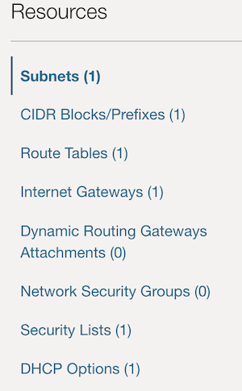

3. Click on the link of **Default Security List...**

4. Click on the **Add Ingress Rules** button:

    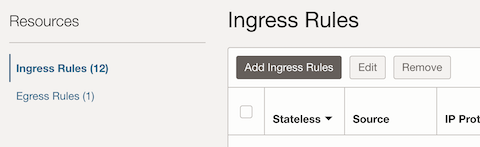

5. Click on the **Add Ingress Rules** button:

    

6. Insert details as shown in the following image and then click **Add Ingress Rules** button:

    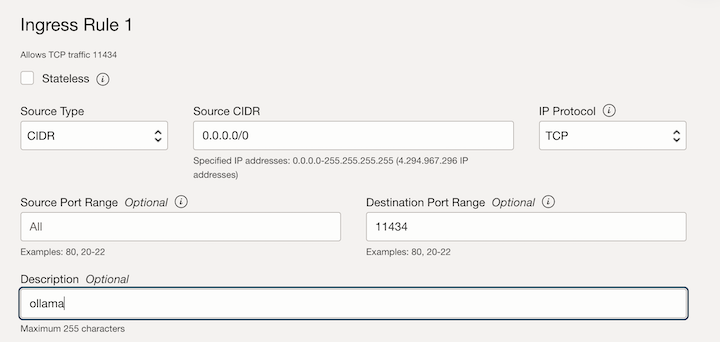

7. Update the `env.sh` file and run `source ./env.sh`:

```
#export OPENAI_URL=http://[GPU_SERVER_IP]:3000
export OPENAI_URL=https://api.openai.com
#export OPENAI_MODEL=NousResearch--llama-2-7b-chat-hf
export OPENAI_MODEL=gpt-3.5-turbo
export OPENAI_EMBEDDING_MODEL=text-embedding-ada-002
export VECTORDB=[VECTORDB_IP]
export DB_USER=vector
export DB_PASSWORD=vector
export OLLAMA_URL=http://[GPU_SERVER_IP]:11434
export OLLAMA_EMBEDDINGS=NousResearch--llama-2-7b-chat-hf
export OLLAMA_MODEL=llama2:7b-chat-fp16
export OPENAI_API_KEY=[YOUR_OPENAI_KEY]
```

8. Test with a shell running:

```
curl ${OLLAMA_URL}/api/generate -d '{
        "model": "llama2:7b-chat-fp16",
        "prompt":"Why is the sky blue?"
}'
```

You'll receive the response in continuous sequential responses, facilitating the delivery of the content little by little, instead of forcing users to wait for the whole response to be generated before it's desplayed to them.

### Customize for private LLMs: Vector Embeddings local, Open AI for Completion

* pom.xml: uncomment the ollama dependency:

```
    <!--//CHANGE-->	
	<!-- Ollama for embeddings -->
		<dependency>
			<groupId>org.springframework.ai</groupId>
			<artifactId>spring-ai-ollama-spring-boot-starter</artifactId>
		 </dependency>
	 	<!--  -->
```

* DemoaiController.java - uncomment with final source code:

```
    //CHANGE
    import org.springframework.ai.ollama.OllamaEmbeddingClient;
    //import org.springframework.ai.ollama.OllamaChatClient;
...

    //CHANGE
    //private final EmbeddingClient embeddingClient;
    private final OllamaEmbeddingClient embeddingClient;

    //CHANGE
    private final ChatClient chatClient;
    //private final OllamaChatClient chatClient;
...

    //CHANGE
    //public DemoaiController(EmbeddingClient embeddingClient, @Qualifier("openAiChatClient") ChatClient chatClient, VectorService vectorService) {  // OpenAI full
    public DemoaiController(OllamaEmbeddingClient embeddingClient, @Qualifier("openAiChatClient") ChatClient chatClient, VectorService vectorService) {  // Ollama Embeddings - OpenAI Completion 
    //public DemoaiController(OllamaEmbeddingClient embeddingClient, OllamaChatClient chatClient, VectorService vectorService) { // Ollama full 
        

```

VectorService.java - check if it's like this:

```
    //CHANGE
    //import org.springframework.ai.ollama.OllamaChatClient;

    ...

    //CHANGE
        private final ChatClient aiClient;
        //private final OllamaChatClient aiClient;

        //CHANGE
        VectorService(@Qualifier("openAiChatClient") ChatClient aiClient) {
        //VectorService(OllamaChatClient aiClient) {

```

Test as done before. In the gpu docker logs, you'll see the chunks coming to be embedded.

### Full private LLMs with `llama2:7b-chat-fp16`

DemoaiController.java - uncomment with final source code:

```
    //CHANGE
    import org.springframework.ai.ollama.OllamaEmbeddingClient;
    import org.springframework.ai.ollama.OllamaChatClient;

    ...
        //CHANGE
        //private final EmbeddingClient embeddingClient;
        private final OllamaEmbeddingClient embeddingClient;

        //CHANGE
        //private final ChatClient chatClient;
        private final OllamaChatClient chatClient;
    ...


    //CHANGE
        @Autowired
        //public DemoaiController(EmbeddingClient embeddingClient, @Qualifier("openAiChatClient") ChatClient chatClient, VectorService vectorService) {  // OpenAI full
        //public DemoaiController(OllamaEmbeddingClient embeddingClient, @Qualifier("openAiChatClient") ChatClient chatClient, VectorService vectorService) {  // Ollama Embeddings - OpenAI Completion 
        public DemoaiController(OllamaEmbeddingClient embeddingClient, OllamaChatClient chatClient, VectorService vectorService) { // Ollama full 
        

```

VectorService.java - uncomment with final source code:

```
    //CHANGE
    import org.springframework.ai.ollama.OllamaChatClient;

    ...


        //CHANGE
        //private final ChatClient aiClient;
        private final OllamaChatClient aiClient;

        //CHANGE
        //VectorService(@Qualifier("openAiChatClient") ChatClient aiClient) {
        VectorService(OllamaChatClient aiClient) {
```

Test as before. Now, you could see a tiny degradation of quality (since the model is quite small), mantaining the same embeddings and context retrieval. For example, with the question:

```
    Q: Which kind of database you can use to run the Java Web example application:
    A: The document states that the application uses Oracle JDBC Thin driver, Universal Connection Pool (UCP), and Java in the Database (using embedded OJVM). Therefore, you can use an Oracle database to run the Java Web example application.
```

This first result doesn't return a very good, personalized result. However, if we  good. But for:

```
    Q: Can I use any kind of development environment to run the example?
    A: the user can use any development environment to run the example as long as it has a Java compiler and a database manager installed. The DOCUMENTS text does not specify any particular IDE that must be used, so any IDE with Java development capabilities should work. However, the guide does recommend using IntelliJ Idea Community Edition for ease of development, but this is not a requirement.\n\nTo answer the user's question, you could say: \"Yes, you can use any development environment to run the example as long as it has a Java compiler and a database manager installed. While the guide recommends using IntelliJ Idea Community Edition for ease of development, any IDE with Java development capabilities should work.\
```

The result is more customized and acceptable.

This trade-off in using private LLMs model could be overcome choosing *larger models*, enough to mantain a good quality.

> **Note**: the number of billions of parameters of a model version usually has a direct correlation with the size of the model, and its generation quality. The higher, the better, although you also need to watch out for OOM (out of memory) errors and a slower generation throughput.

## 3. Deploy on Oracle Backend for Spring Boot and Microservices

Let's show what Oracle can offer to deploy on an enterprise grade the GenAI application developed so far.

The platform [**Oracle Backend for Spring Boot and Microservices**](https://oracle.github.io/microservices-datadriven/spring/) allows developers to build microservices in Spring Boot and provision a backend as a service with the Oracle Database and other infrastructure components that operate on multiple clouds. This service vastly simplifies the task of building, testing, and operating microservices platforms for reliable, secure, and scalable enterprise applications.

To setup this platform, follow the instruction included in **Lab1: Provision an instance** and **Lab 2: Setup your Development Environment** of the [LiveLabs: CloudBank - Building an App with Spring Boot and Mobile APIs with Oracle Database and Kubernetes](https://apexapps.oracle.com/pls/apex/f?p=133:180:7384418726808::::wid:3607). At the end, proceed with the following steps:

1. In the `application.properties` change the active env as `prod`:

```
spring.profiles.active=prod
```

2. In the `application-prod.properties`, change the parameters in `< >` with the values set in `env.sh`:

```
    spring.ai.openai.api-key=<OPENAI_API_KEY>
    spring.ai.openai.base-url=<OPENAI_URL>
    spring.ai.openai.chat.options.model=gpt-3.5-turbo
    spring.ai.openai.embedding.options.model=text-embedding-ada-002
    spring.datasource.url=jdbc:oracle:thin:@<VECTORDB>:1521/ORCLPDB1
    spring.datasource.username=vector
    spring.datasource.password=vector
    spring.datasource.driver-class-name=oracle.jdbc.OracleDriver
    config.tempDir=tempDir
    config.dropDb=true
    config.vectorDB=vectortable
    config.distance=EUCLIDEAN
    spring.servlet.multipart.max-file-size=10MB
    spring.servlet.multipart.max-request-size=20MB
    spring.ai.ollama.base-url=<OLLAMA_URL>
    spring.ai.ollama.embedding.options.model=nomic-embed-text
    spring.ai.ollama.chat.options.model=llama2:7b-chat-fp16
```

3. Open a terminal, and using the **Kubernetes** admin command, open a port forward to the backend:

```
kubectl -n obaas-admin port-forward svc/obaas-admin 8080:8080
```

4. Using the command-line tool `oractl`, deploy the application running the following commands:

```
oractl:>connect
? username obaas-admin
? password **************

oractl:>create --app-name rag
oractl:>deploy --app-name rag --service-name demoai --artifact-path /Users/cdebari/Documents/GitHub/spring-ai-demo/target/demoai-0.0.1-SNAPSHOT.jar --image-version 0.0.1 --service-profile prod

```

5. Let's test the application with port forwarding. First, we need to stop the current `demoai` instance running on the background, to free the previous port being used; and, in a different terminal, run a port forwarding on port 8080 to the remote service on the **Oracle Backend for Spring Boot and Microservices**:

```
kubectl -n rag port-forward svc/demoai 8080:8080
```

6. In a different terminal, test the service as done before, for example:

```
curl -X POST http://localhost:8080/ai/rag \
        -H "Content-Type: application/json" \
        -d '{"message":"Can I use any kind of development environment to run the example?"}' | jq -r .generation
```

## Notes/Issues

Additional Use Cases like summarization and embedding coming soon.

## URLs

- [Oracle AI](https://www.oracle.com/artificial-intelligence/)
- [AI for Developers](https://developer.oracle.com/technologies/ai.html)

## Contributing

This project is open source.  Please submit your contributions by forking this repository and submitting a pull request!  Oracle appreciates any contributions that are made by the open-source community.

## License

Copyright (c) 2024 Oracle and/or its affiliates.

Licensed under the Universal Permissive License (UPL), Version 1.0.

See [LICENSE](LICENSE) for more details.

ORACLE AND ITS AFFILIATES DO NOT PROVIDE ANY WARRANTY WHATSOEVER, EXPRESS OR IMPLIED, FOR ANY SOFTWARE, MATERIAL OR CONTENT OF ANY KIND CONTAINED OR PRODUCED WITHIN THIS REPOSITORY, AND IN PARTICULAR SPECIFICALLY DISCLAIM ANY AND ALL IMPLIED WARRANTIES OF TITLE, NON-INFRINGEMENT, MERCHANTABILITY, AND FITNESS FOR A PARTICULAR PURPOSE.  FURTHERMORE, ORACLE AND ITS AFFILIATES DO NOT REPRESENT THAT ANY CUSTOMARY SECURITY REVIEW HAS BEEN PERFORMED WITH RESPECT TO ANY SOFTWARE, MATERIAL OR CONTENT CONTAINED OR PRODUCED WITHIN THIS REPOSITORY. IN ADDITION, AND WITHOUT LIMITING THE FOREGOING, THIRD PARTIES MAY HAVE POSTED SOFTWARE, MATERIAL OR CONTENT TO THIS REPOSITORY WITHOUT ANY REVIEW. USE AT YOUR OWN RISK.
